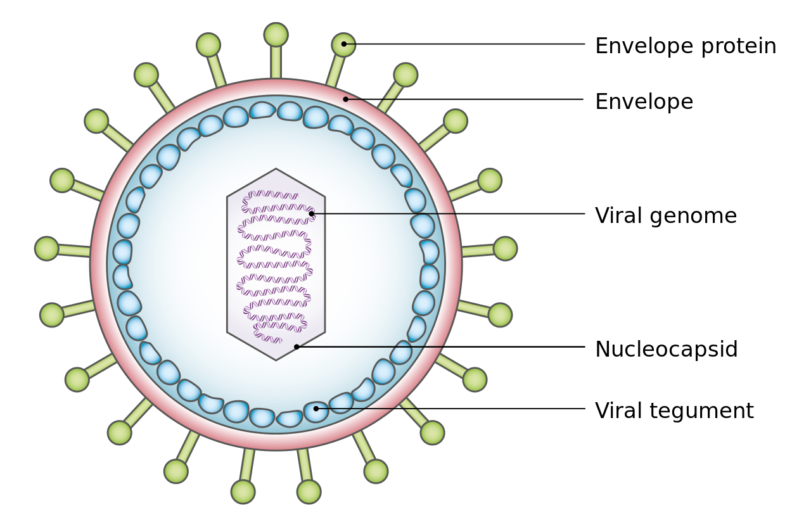
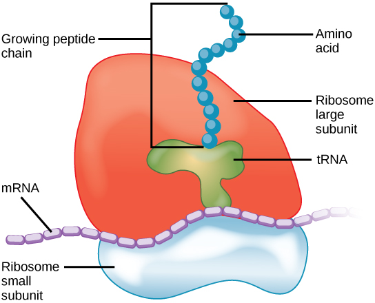
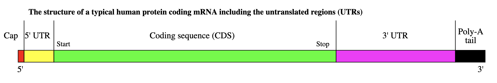
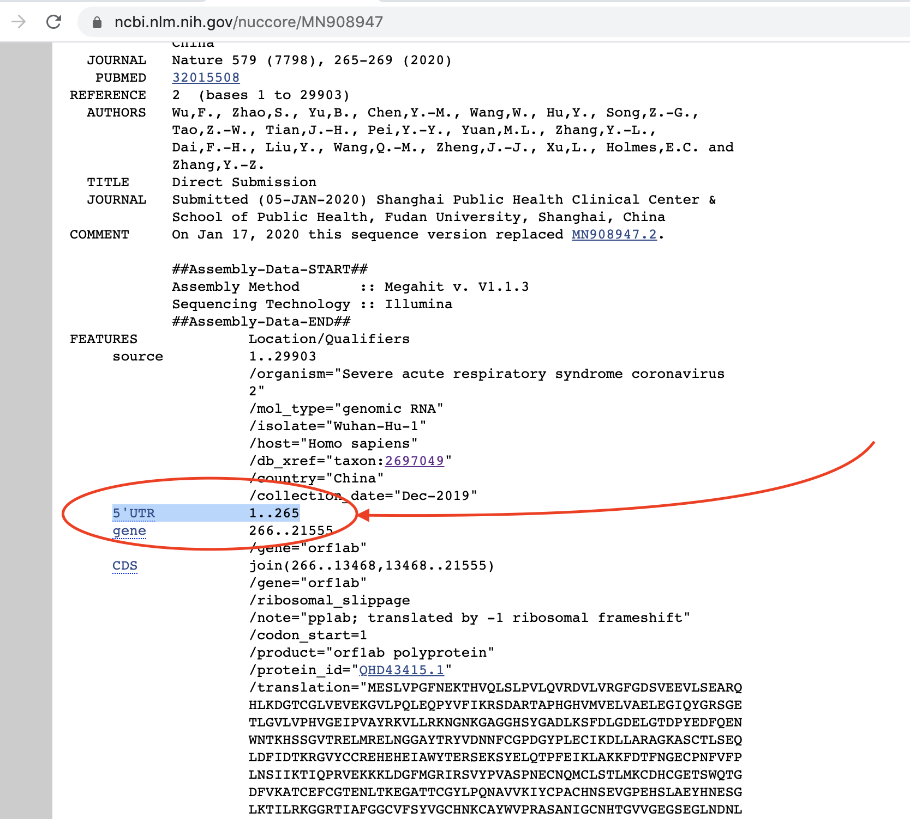
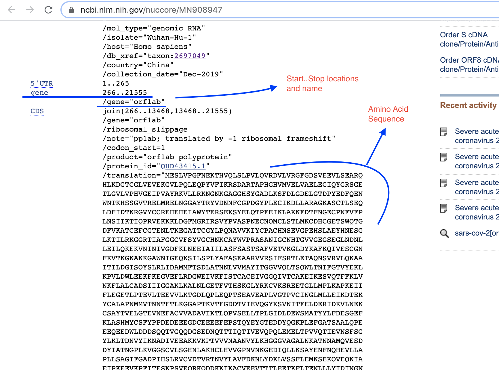

# Reverse Engineering Coronavirus with Python

## Intro

Can computer programming and medicine come together to form a powerful synergy? Absolutely!

This article wants to show how the Python programming language can be used to perform various tasks on biological data and most importantly to automate a simple workflow. Automating tasks saves time to doctors and researchers, and lets them digest more data for better insights.

Specifically I will approach the sars-cov-2 virus as if it was a computer virus, and I'll attempt to reverse engineer it by analyzing its components and understanding its modus operandi.

I am not a trained and professional scientist, meaning I do not have an MD or a PhD in life sciences, so please if anything is inaccurate leave a comment below.

This article is meant to be read by everyone, I will keep concepts simple and explain everything so even if you do not have a background in biology you can follow along and learn some interesting things.

## Our Specimen

In order to get started we need a specimen to analyze, if this was a computer virus I would find it in some malware database website like https://thezoo.morirt.com/, but here we are dealing with a human virus, so I headed to https://www.ncbi.nlm.nih.gov/ and searched for "sars-cov-2".

I immediately found the full genome of the virus, which interestingly enough had a lot of samples available:


I picked the MN908947 one, which was the first sample taken in Wuhan in December 2019.

The specimen is located at https://www.ncbi.nlm.nih.gov/nuccore/MN908947, but before getting the hands dirty lets brush up on knowledge and explain some background information.

## Viruses and Human Cells

Let's forget about COVID19 for a moment and start from the beginning, what is a virus?

A virus is not an organism or a living form, but an infectious entity that enters a human or animal host and hacks its internal machinery in order to replicate itself and spread even further. As an infected host come into contact with other organisms the virus can infect them too. Picture a virus like this:

[img 2]


How does this happen exactly? Animal cells have an organelle called Ribosome, and what the ribosome does is creating amino acids from a piece of mRNA (messenger RNA). So as a metaphor imagine the Ribosome as a car factory, mRNA is the instructions/blueprints and the amino acids produced are the final car parts. The amino acids created by the ribosome will then be assembled together in the cell and will form a protein, just like car parts form a car when they're assembled together.


_image taken from Wikimedia Commons_

As you can see the ribosome reads the mRNA string to produce a multitude of amino acids (called a peptide chain). These amino acids form proteins, and proteins are the building blocks of life because they perform all kinds of functions.

This is the exact place where the virus will take over and mess things up, but how? Well the ribosome is pretty dumb, meaning that it just synthesizes whatever it receives as mRNA without questioning anything. So what is it going to happen when a virus injects his own RNA string into the cell? The ribosomes will pick it up and immediately follow the instructions written in that piece of viral RNA, producing more copies of the proteins that make up that virus.

This way the virus basically takes over the cell protein factory and can now multiply itself vastly, infecting more cells and forcing more ribosomes to work for him. This will produce inflammation and other side effects, making people experience the symptoms of the particular virus that infected them. Some viruses can be eliminated by our immune system through the production of antibodies, other are harder to fight off.

This the basic simplified mechanism for viral infection and replication. I have been talking about "a virus" generically, but as you can imagine there are many many kinds of viruses. Just like organisms have a taxonomy and a classification viruses have their own classification. The systems for taxonomically classifying viruses are mainly two:

- The International Committee on Taxonomy of Viruses (ICTV) system
- The Baltimore classification system

## Analysis of specimen

So now that we know some useful background information about viruses and how they work, let's get back to our specimen and start learning more about it.

According to the ICTV system this virus belongs to the subfamily Orthocoronavirinae, in the family Coronaviridae, order Nidovirales, and realm Riboviria.

According to the Baltimore Classification system this virus is a (+)ssRNA (= positive-sense single-stranded RNA) virus.

Having a positive polarity of RNA means that the virus can serve directly its genetic information as mRNA to the ribosome and get it translated into amino acids without having to transcribe it or any kind of preprocessing. This means it is very infectious, and many "famous" viruses belong to this family: hepatitis C, west nile virus, dengue virus, SARS, MERS, common cold virus, rhinoviruses, and many more.

This means that the genome at https://www.ncbi.nlm.nih.gov/nuccore/MN908947 can be transcribed immediately into RNA and translated into proteins. But before doing that let's write the code that will read the whole viral genome and store it in a variable.

### Putting the genome in a variable

As a first step I'll go to my terminal and download the FASTA format of the genome. FASTA is a file format widely used in bioinformatics to represent a sequence of nucleotides or amino acids. Since we're dealing with a viral genome the file will contain a sequence of nucleotides.

So I copied the content of the fasta data here (url)https://www.ncbi.nlm.nih.gov/nuccore/MN908947.3?report=fasta&log$=seqview&format=text into a local file and called it `MN908947.3_sars-cov-2.fasta`.

Now that I have the genome file in my local folder let's finally start writing the python program to parse it and store it into a variable:

```python
# Read in the genome of the virus
genomeFile = open('MN908947.3_sars-cov-2.fasta', 'r')
sars_cov_2_g0_raw = genomeFile.read().rstrip().split("\n")

sars_cov_2_g0 = {
    "description": "",
    "genome": "",
    "rna": ""
}

for line in sars_cov_2_g0_raw:
    if line[0] == ">":
        sars_cov_2_g0["description"] = line
    else:
        sars_cov_2_g0["genome"] += line

print(sars_cov_2_g0)
```

Note that if a line starts with ">" then it's not genome data but a string that describes the nucleotide data coming next, therefore it gets stored under the 'description' dictionary key. Running the code gives this output:

```python
{'description': '>MN908947.3 Severe acute respiratory syndrome coronavirus 2 isolate Wuhan-Hu-1, complete genome', 'genome': 'ATTAAAGGTTT...AAA', 'rna': ''}
```
_(I did cut out the 'genome' part because it's just a very long string of A T C and Gs)_

The 'rna' dictionary key is left blank because it will be filled up in a next step.

At this point we have the sars-cov-2 genome stored in a variable as a nucleotide sequence string, under the key 'genome' of the dictionary.

The first things we can do is to determine the length of the nucleotide sequence, therefore determining the total amount of data describing the virus. The code for this simply uses a `len()` method:

```python
# Determine amount of data in the virus
print(f"SARS-COV-2 genome is {len(sars_cov_2_g0['genome'])} characters long, meaning it has {len(sars_cov_2_g0['genome']) / 1000}kB of data")

```
Which outputs on stdout:
```
SARS-COV-2 genome is 29903 characters long, meaning it has 29.903kB of data
```

If we want to use a computer science jargon we would say that the sars-cov-2 has almost 30 kilobytes of data (1 character = 1 byte), while if we want to use a more biological friendly unit we would say "30 kilobases" instead.

### Transcription (viral genome to RNA)

Let's start now the transcription and the translation part. Transcription comes first and it's the creation of a complementary string of RNA from the genome (acting like a blueprint). To accomplish this we need to turn all the "T"s into "U"s because RNA sequences do not have Thiamine but Uracil as one of the nucleic acids, the rest are identical from DNA. In python this can be accomplished in one line of code:

```python
sars_cov_2_g0['rna'] = sars_cov_2_g0['genome'].replace("T", "U")
```

I stored the rna string in another dictionary key, just to keep things together in order.

### Getting genes RNA locations

Now that we have an RNA string, we are ready to see what amino acids are produced from it by simulating the tasks of the ribosome, but first we need to find the coordinates of each gene location. One gene corresponds to a piece of the genomic RNA, so one gene codes for a protein.

Not the whole RNA sequence is going to be a translatable region, in fact there are two segments called 5'UTR and 3'UTR that are not translated into protein and therefore need to be cut off. Here's a visual representation of an RNA string:




To figure out where to cut exactly and where does the 5'UTR start and finish the genome page at https://www.ncbi.nlm.nih.gov/nuccore/MN908947 has to be consulted. Here the point that says the duration of the 5'UTR:



And we can write the code that stores these pieces in different variables:

```python
# store parts of the genomic rna in variables
sars_cov_2_5utr = sars_cov_2_g0['rna'][0:265]
sars_cov_2_transl = sars_cov_2_g0['rna'][265:29674]
sars_cov_2_3utr = sars_cov_2_g0['rna'][29674:29903]
```

Obviously our focus now will be on `sars_cov_2_transl`, which is the translatable region of our rna sequence. This region is used as a blueprint (or a template) to create a series of amino acids that will be linked together in various groups to form proteins.

To find out exactly which regions of `sars_cov_2_transl` translate into which proteins I went back to the NCBI page and looked through each
"gene" entry, like this:



So let's put them all into variables! At this point I wanted to use the NCBI API to get the genes location programmatically, and I did find in the documentation the correct url to obtain this data (_https://eutils.ncbi.nlm.nih.gov/entrez/eutils/efetch.fcgi?db=nuccore&id=MN908947.3_ NOTE: here the `db` parameter is the Nucleotides database _"nuccore"_ and the `id` parameter is the sars-cov-2 gene ID _"MN908947.3"_).

Unfortunately the data does not come back in JSON or even XML, but in a format called asn1, which I could not parse with a couple of asn1 decoders for python such as https://pypi.org/project/asn1/. So at this point I was a bit stuck.

I could manually copy all the gene locations and hardcode them into variables, there's no more than ten of them, but I really was determined to automate this task. I tried a few more ideas, and realized that I could scrape the main html web page of the genome to get this data. Surely I would have to do some manual data parsing and write a bit more code to get to the end result, but nothing too difficult because the webpage looked pretty standardized and regular.

We are not querying the page excessively and putting load to the NCBI web servers because only one request is made each time the python program is ran, so it's definitely ok to scrape it.

Here's the code to query and then parse that data into an array of protein objects, it requires `import requests` and `import re` statements on top of the file:

```python
NCBI_page = requests.get('https://www.ncbi.nlm.nih.gov/sviewer/viewer.fcgi?id=MN908947.3&db=nuccore&report=genbank&conwithfeat=on&withparts=on&hide-cdd=on&retmode=text&withmarkup=on&tool=portal&log$=seqview&maxdownloadsize=1000000')

split_data_ncbi = NCBI_page.text.split("\n")
sars_cov_2_genes = []
gene = {}

# go thru the scraped page line by line and put the gene data in order
for line in split_data_ncbi:
    # get location
    geneloc_regex = r"\d+\.\.\d+"
    location_matches = re.findall(geneloc_regex, line, re.MULTILINE)
    if "gene" in line and len(location_matches) > 0:
        location_split = location_matches[0].split("..")
        location_parsed = {
         "from": int(location_split[0]),
         "to": int(location_split[1])
        }
        gene["location"] = location_parsed
    # get gene name
    if "/gene=" in line:
        gene["gene_name"] = line.split("\"")[1]
    # get protein name
    if "/product=" in line:
        gene["protein_name"] = line.split("\"")[1]
    # get protein_id
    if "/protein_id=" in line:
        gene["protein_id"] = line.split("\"")[1]
        # since protein_id is the last data point for each gene we
        # now get the rna part
        rna_from = gene["location"]["from"] - 1
        rna_to = gene["location"]["to"]
        gene["rna"] = sars_cov_2_g0['rna'][rna_from:rna_to]
        # add the gene object to the genes array and empty it out
        # to free space for the next gene
        sars_cov_2_genes.append(gene)
        gene = {}

# pretty print the genes data
for gene in sars_cov_2_genes:
    print(gene)

```

Which outputs:

```python
{'location': {'from': 266, 'to': 21555}, 'gene_name': 'orf1ab', 'protein_name': 'orf1ab polyprotein', 'protein_id': 'QHD43415.1', 'rna': 'AUGGAGAGCCUUGUCCC...UGUUCUUGUUAACAACUAA'}
{'location': {'from': 21563, 'to': 25384}, 'gene_name': 'S', 'protein_name': 'surface glycoprotein', 'protein_id': 'QHD43416.1', 'rna': 'AUGUUUGUUUUUCUUG...AGCGUGCCUUUGUAA'}
{'location': {'from': 26245, 'to': 26472}, 'gene_name': 'E', 'protein_name': 'envelope protein', 'protein_id': 'QHD43418.1', 'rna': 'AUGUACUCAUUC...CUUCUGGUCUAA'}
{'location': {'from': 26523, 'to': 27191}, 'gene_name': 'M', 'protein_name': 'membrane glycoprotein', 'protein_id': 'QHD43419.1', 'rna': 'AUGGCAGAUUCCAACG...UUGCUUGUACAGUAA'}
{'location': {'from': 27202, 'to': 27387}, 'gene_name': 'ORF6', 'protein_name': 'ORF6 protein', 'protein_id': 'QHD43420.1', 'rna': 'AUGUUU...GAUUAA'}
{'location': {'from': 27394, 'to': 27759}, 'gene_name': 'ORF7a', 'protein_name': 'ORF7a protein', 'protein_id': 'QHD43421.1', 'rna': 'AUGAAAAUUAUUC...AGACAGAAUGA'}
{'location': {'from': 27894, 'to': 28259}, 'gene_name': 'ORF8', 'protein_name': 'ORF8 protein', 'protein_id': 'QHD43422.1', 'rna': 'AUGAAAUUUCU...GUUUUAGAUUUCAUCUAA'}
{'location': {'from': 28274, 'to': 29533}, 'gene_name': 'N', 'protein_name': 'nucleocapsid phosphoprotein', 'protein_id': 'QHD43423.2', 'rna': 'AUGUCUGAUAAUGGACCCCA...AACUCAGGCCUAA'}
{'location': {'from': 29558, 'to': 29674}, 'gene_name': 'ORF10', 'protein_name': 'ORF10 protein', 'protein_id': 'QHI42199.1', 'rna': 'AUGGGCUAUAUA...UUAAUCUCACAUAG'}
```

Obviously I chopped the rna sequences with a "..." in order to keep the text clean in the article.

### RNA to amino acids

Now that we have a clean list of genes let's translate each of them into an amino acid sequence. ...
